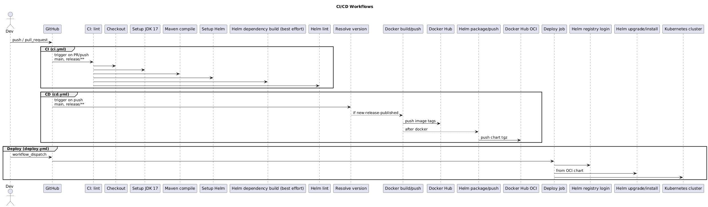

# CI/CD Workflows (GitHub Actions)

This document describes the current CI/CD pipelines defined in `.github/workflows/`.

## Overview

Workflows:

- `ci.yml`: compile + Helm lint on PRs and pushes.
- `cd.yml`: build/push Docker image and publish Helm chart to OCI on release-worthy pushes.
- `deploy.yml`: manual deployment from the published OCI chart.

Artifacts:

- Docker image: `docker.io/<DOCKER_HUB_LOGIN>/verana-faucet-hologram-chatbot`
- Helm chart (OCI): `oci://registry-1.docker.io/<DOCKER_HUB_LOGIN>/verana-faucet-hologram-chatbot-chart`

## Workflow: CI (`ci.yml`)

Triggers:

- `pull_request` to `main` or `release/**`
- `push` to `main` or `release/**`

Concurrency:

- `lint-${{ github.ref }}` (cancels in-progress runs on the same ref)

Steps (job: `lint`):

1. Checkout repository.
2. Set up JDK 17 (Temurin) + Maven cache.
3. `./mvnw -B -DskipTests compile`
4. Set up Helm.
5. `helm dependency build ./charts` (best effort if `Chart.yaml` exists).
6. `helm lint ./charts`

## Workflow: CD (`cd.yml`)

Triggers:

- `push` to `main` or `release/**`

Permissions:

- `id-token: write`, `contents: write`, `issues: write`, `pull-requests: write`

Jobs:

### 1) `resolve-version` (reusable workflow)

Uses `2060-io/organization/.github/workflows/resolve-version-call.yml@main` to determine:

- `new-release-published` (gates the rest of the pipeline)
- `release-type` (`dev` or `stable`)
- `release-version`, `release-major`, `release-minor`, `release-patch`

### 2) `docker` (build & push image)

Runs only if `new-release-published == 'true'`.

Key behavior:

- For `stable`: `IMAGE_TAG=latest`
- For `dev`: `IMAGE_TAG=dev` and `SUFFIX=-dev`
- Builds with Quarkus and pushes to Docker Hub using:
  - `secrets.DOCKER_HUB_LOGIN`
  - `secrets.DOCKER_HUB_PWD`

Tags pushed:

- Stable: `latest`, `v<major>`, `v<major>.<minor>`, `v<release-version>`
- Dev: `dev`, `v<major>-dev`, `v<major>.<minor>-dev`, `v<major>.<minor>.<patch_short>-dev`, `v<release-version>`

### 3) `helm` (package & push chart)

Runs only if `new-release-published == 'true'` and after `docker`.

Key behavior:

- Strips leading `v` from `release-version`.
- Updates `charts/Chart.yaml` with the target version.
- Runs `helm dependency update ./charts`.
- Packages the chart and pushes it to the OCI registry at Docker Hub.

## Workflow: Deploy (`deploy.yml`)

Triggers:

- `workflow_dispatch` (manual)

Inputs:

- `chart_version` (required)
- `namespace` (default: `didcomm-chatbots`)
- `release_name` (default: `verana-faucet-hologram`)

Steps:

1. Set up `kubectl` and Helm.
2. Configure kubeconfig from `secrets.OVH_KUBECONFIG_DEVNET`.
3. `helm registry login registry-1.docker.io` using Docker Hub credentials.
4. `helm upgrade --install` from the OCI chart:
   - `--version <chart_version>`
   - `--create-namespace`
   - `--wait --atomic --timeout 20m`
   - Secrets passed via `--set-string`:
     - `postgres.secret.password`
     - `chatbotBackend.secret.QUARKUS_ARTEMIS_PASSWORD`
     - `faucetApp.secret.FAUCET_MNEMONIC`
     - `stats.secret.QUARKUS_ARTEMIS_A0_PASSWORD`
     - `stats.secret.QUARKUS_DATASOURCE_PASSWORD`

## Secrets used

- `DOCKER_HUB_LOGIN`
- `DOCKER_HUB_PWD`
- `OVH_KUBECONFIG_DEVNET`
- `POSTGRES_PASSWORD`
- `ARTEMIS_PASSWORD`
- `FAUCET_MNEMONIC`

